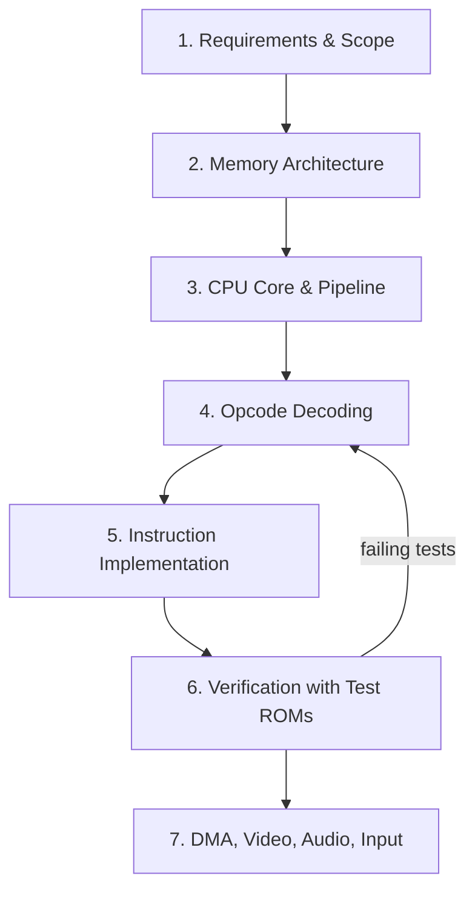

# GBA Emulator

An in-progress Game Boy Advance emulator written in C++17. The current focus is the
ARM7TDMI CPU core and the memory bus — the parts that actually execute a game — with video,
audio, DMA, and input still to come.

---

## Project Status

Working right now:

- A memory bus that maps every GBA hardware region (BIOS, WRAM, IRAM, IO, palette, VRAM, OAM, and Game Pak ROM)
- An ARM7TDMI core with register banking, the CPSR/SPSR status registers, and a 3-stage pipeline
- ARM (32-bit) and THUMB (16-bit) instruction decoding and execution
- A test runner that boots `jsmolka/gba-tests` ROMs and checks the result by watching registers

Not built yet: DMA, video (PPU), audio (APU), and input.

---

## Overview

| Area | Details |
|---|---|
| Language | C++17 |
| Build system | CMake |
| Rendering | SDL2 (linked, not yet used for display) |
| CPU | ARM7TDMI, ARM and THUMB instruction sets |
| Memory | Centralized `MemoryBus` with all GBA regions |
| Tests | `jsmolka/gba-tests` ROMs (ARM + THUMB) |

---

## System Architecture

```
+------------------------------ GBA Emulator (C++) ------------------------------+
|                                                                                |
|  main.cpp — loads a test ROM, resets the CPU, runs the step() loop,            |
|             and detects pass/fail by watching the program counter and r12      |
|      |                                                                         |
|      v                                                                         |
|  ARM7TDMI (CPU core)         ARMOps + THUMBOps + ALUHelpers                    |
|    - 31 physical registers    - instruction handlers for each opcode           |
|    - CPSR + 5 SPSRs           - shift/rotate helpers for loads and ALU ops     |
|    - 7 operating modes                                                         |
|    - 3-stage fetch/decode/execute pipeline                                     |
|      |                                                                         |
|      v                                                                         |
|  MemoryBus (memory map)                                                        |
|    BIOS | WRAM | IRAM | IO registers | Palette | VRAM | OAM | Game Pak ROM     |
+-------------------------------------+------------------------------------------+
                                      |
              +-----------------------+-----------------------+
              |                                               |
              v                                               v
   gba-tests/arm/arm.gba                          SDL2 (for video/audio later)
   gba-tests/thumb/thumb.gba
```

Every read and write the CPU makes goes through `MemoryBus`, which routes the address to the
right region the same way the real hardware does. The CPU never touches arrays directly.

---

## Design Requirements

| ID | Requirement |
|---|---|
| R1 | Execute the full ARM7TDMI instruction set in both ARM and THUMB modes |
| R2 | Model the GBA's memory map so all hardware lives at its correct address |
| R3 | Keep CPU state accurate: 16 logical registers, banked physical registers, CPSR/SPSR, and operating modes |
| R4 | Mirror the real 3-stage fetch-decode-execute pipeline |
| R5 | Decode instructions in a way that scales to the hundreds of opcodes |
| R6 | Pass the `jsmolka/gba-tests` CPU test ROMs |
| R7 | Eventually add DMA, video, audio, and input on top of the working CPU |

---

## Systems Design Process

The emulator is being built from the inside out: get the CPU and memory right first, prove it with
test ROMs, then layer graphics and sound on top.



### Phase 1 — Requirements & Scope

Decided to build the emulator around the CPU first, since nothing else works without a correct
core. The target was set by what the real hardware does and by the `jsmolka/gba-tests` suite.

### Phase 2 — Memory Architecture

Built `MemoryBus` as the single source of truth for all memory. The GBA has no separate disk or
GPU memory — everything (graphics, sound, input) is mapped to a fixed address range, so the bus
holds arrays for each region and dispatches reads and writes by the top byte of the address.

- `memoryBus.h` / `memoryBus.cpp` — region allocation and `read8/16/32` + `write8/16/32`

### Phase 3 — CPU Core & Pipeline

Laid out the ARM7TDMI state: 31 physical registers (16 logical plus banked copies), the CPSR,
five SPSRs, and seven operating modes. A simulated 3-stage pipeline keeps the program counter
two instructions ahead of the one currently executing, matching real ARM behavior.

- `ARM7TDMI.h` / `ARM7TDMI.cpp` — register banking, modes, pipeline, `step()`

### Phase 4 — Opcode Decoding

Instruction decoding uses lookup tables and switch statements split by opcode bits. THUMB
instructions are 16 bits and tightly packed, so they're grouped by bits 13–15 first and then
narrowed with masks like `0xF800` and `0xFC00`.

- `ARM7TDMI.cpp` — `executeARM()` / `executeTHUMB()` dispatch

### Phase 5 — Instruction Implementation

Filled in the handlers, split across two friend classes so ARM and THUMB logic stay separate.

- `ARMOps.cpp` — BX, branch, SWI, MRS/MSR, ALU, single data transfer, halfword/signed transfer, block transfer, swap, multiply
- `THUMBOps.cpp` — shifted-register moves, add/sub, ALU, hi-register ops, loads/stores, push/pop, SWI, branches
- `ALUHelpers.cpp` — barrel shifter and misaligned-read rotation

### Phase 6 — Verification

To validate the core without a working display, test ROMs are mapped straight to `0x08000000` to
skip the BIOS boot sequence. The runner executes instructions until it hits an infinite loop or a
known register value, then prints the result.

- `main.cpp` — loads `arm.gba`, resets the CPU, force-jumps to the ROM, and reports pass/fail

### Phase 7 — DMA, Video, Audio, Input

Still ahead. See Next Steps.

---

## What's Implemented So Far

**Memory bus**

- BIOS, WRAM, IRAM, IO registers, palette RAM, VRAM, OAM, and dynamically sized Game Pak ROM
- Little-endian `read8/16/32` and `write8/16/32`, with unmapped addresses returning zero

**ARM7TDMI core**

- 16 logical registers (R0–R15) with banked physical registers for IRQ/FIQ and other modes
- CPSR plus five banked SPSRs, and all seven operating modes
- 3-stage pipeline with proper flushing and refilling on branches

**ARM instructions**

- Branch and exchange (`BX`), branch / branch-with-link
- PSR transfers (`MRS`/`MSR`)
- ALU data processing with shift support
- Single data transfer with writeback, halfword and signed-byte/halfword transfer
- Block data transfer (`LDM`/`STM`), single data swap (`SWP`), and multiply
- Software interrupt (`SWI`)

**THUMB instructions**

- Shifted-register moves, add/sub, move/compare/add/sub immediate, and ALU ops
- Hi-register operations and branch exchange
- PC-relative load, load address, and SP-relative load/store
- Load/store with register or immediate offsets, including signed byte/halfword and halfword
- Push/pop and multiple load/store
- Conditional and unconditional branches, long branch with link, and `SWI`

---

## How to Build and Run

Dependencies:

- CMake 3.10+
- A C++17 compiler
- SDL2

Build and run:

```
cd src/build
cmake ..
make
./GBA_Emulator
```

The runner loads `../../gba-tests/arm/arm.gba` (relative to the build directory). To run the THUMB
tests, point `main.cpp` at `../../gba-tests/thumb/thumb.gba`.

---

## Next Steps

1. **Pass the full CPU test suite.** Finish the remaining ARM and THUMB edge cases until both
   `arm.gba` and `thumb.gba` pass end to end.
2. **DMA.** Add the four DMA channels. Games rely on DMA to move graphics and audio data around,
   and many hang on a white screen without it.
3. **Video (PPU).** Start with bitmap modes 3, 4, and 5 — Mode 3 is a flat 16-bit framebuffer and
   the simplest thing to render — and draw it with SDL2.
4. **Audio (APU) and input.** The GBA has two FIFO sound channels plus four Game Boy-style
   channels; output through an SDL2 audio queue and map keyboard input to the `KEYINPUT` register.

---

## Repository Structure

| Path | Purpose |
|---|---|
| `src/main.cpp` | Test runner and pass/fail detection |
| `src/ARM7TDMI.h` / `.cpp` | CPU core, registers, pipeline, dispatch |
| `src/ARMOps.h` / `.cpp` | ARM instruction handlers |
| `src/THUMBOps.h` / `.cpp` | THUMB instruction handlers |
| `src/ALUHelpers.h` / `.cpp` | Barrel shifter and read helpers |
| `src/memoryBus.h` / `.cpp` | Memory map and read/write bus |
| `src/CMakeLists.txt` | Build configuration |
| `gba-tests/arm/arm.gba` | ARM CPU test ROM |
| `gba-tests/thumb/thumb.gba` | THUMB CPU test ROM |
